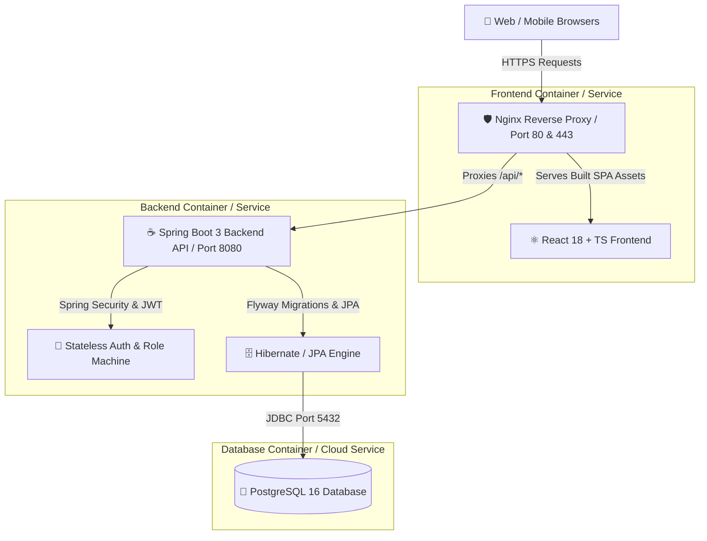

# 🚀 KEYSTONE - Full-Stack Production Deployment Guide

This comprehensive guide covers step-by-step instructions for deploying **Keystone** (Spring Boot 3 backend + PostgreSQL + React TypeScript Vite frontend) to production across popular hosting platforms and container environments.

---

## 📐 1. System Architecture & Topology



---

## 📋 2. Pre-Deployment Checklist

Before deploying, ensure you have:
- [x] **PostgreSQL 16** database instance (Cloud managed database like Render Postgres, Supabase, Neon, AWS RDS, or Docker container).
- [x] **Secret Keys**: A strong random 256-bit hexadecimal or Base64 string for `JWT_SECRET`.
- [x] **Domain / Allowed Origins**: The production URL of your frontend (e.g., `https://keystone.yourdomain.com`).
- [x] **CORS Configuration**: Ensuring the backend's `ALLOWED_ORIGINS` includes your frontend production URL.

---

## 🐳 Option 1: One-Command Docker Compose (VPS / AWS EC2 / DigitalOcean)

This is the easiest and most robust method to run the complete stack (PostgreSQL + Spring Boot Backend + Nginx Frontend) on a single Linux Server, AWS EC2, or DigitalOcean Droplet.

### Steps:

1. **Clone the repository on your server**:
   ```bash
   git clone https://github.com/BorudePiyush/Keystone-Feild.git
   cd Keystone-Feild/Keystone
   ```

2. **Configure Environment Variables**:
   Copy the example `.env` template and set your production values:
   ```bash
   cp .env.example .env
   ```
   Edit `.env`:
   ```env
   DB_NAME=keystone
   DB_USER=keystone_admin
   DB_PASSWORD=SuperSecretPassword2026!
   JWT_SECRET=c8f8b8e91859755609b40094ec200908f981a4f981859755609b40094ec2009
   ALLOWED_ORIGINS=http://your-server-ip,https://keystone.yourdomain.com
   ```

3. **Build & Launch Containers**:
   ```bash
   docker compose up --build -d
   ```

4. **Verify Application Health**:
   - Frontend Application: `http://<YOUR-SERVER-IP>`
   - Backend Actuator Health: `http://<YOUR-SERVER-IP>:8080/actuator/health`
   - Backend Swagger Docs: `http://<YOUR-SERVER-IP>:8080/swagger-ui/index.html`

5. **Container Management Commands**:
   ```bash
   # View live logs
   docker compose logs -f

   # Check container status
   docker compose ps

   # Stop all services
   docker compose down
   ```

---

## ☁️ Option 2: Platform-as-a-Service Deployment (Render / Railway + Vercel)

For zero-server management, deploy backend + database to **Render** or **Railway**, and frontend to **Vercel** or **Netlify**.

### Phase A: Deploy PostgreSQL & Backend (Render / Railway)

#### Step A1: Provision Managed PostgreSQL Database
1. Go to [Render Dashboard](https://dashboard.render.com/) or [Railway](https://railway.app/).
2. Create a new **PostgreSQL Database**.
3. Note down the database connection credentials:
   - `Host`
   - `Database Name`
   - `Username`
   - `Password`
   - `Port` (5432)

#### Step A2: Deploy Spring Boot Backend Web Service
1. Create a new **Web Service** on Render connected to your Git Repository.
2. Set Root Directory to `Keystone/backend`.
3. Choose Environment: **Docker** (it will auto-detect `Keystone/backend/Dockerfile`) OR **Java**.
4. Add the following **Environment Variables**:
   
   | Variable Name | Example Value / Purpose |
   | :--- | :--- |
   | `SPRING_PROFILES_ACTIVE` | `postgres` |
   | `DB_HOST` | `<your-render-postgres-host>` |
   | `DB_PORT` | `5432` |
   | `DB_NAME` | `keystone` |
   | `DB_USER` | `<your-db-user>` |
   | `DB_PASSWORD` | `<your-db-password>` |
   | `JWT_SECRET` | `generate-a-long-random-secret-string-here` |
   | `ALLOWED_ORIGINS` | `https://keystone.vercel.app` *(Your Vercel frontend URL)* |
   | `PORT` | `8080` |

5. Click **Deploy Web Service**. Flyway will automatically execute database migrations (`V1__init_schema.sql`, `V2__seed_demo_data.sql`) upon startup.

---

### Phase B: Deploy React Frontend (Vercel / Netlify)

1. Go to [Vercel Dashboard](https://vercel.com/) -> **Add New Project**.
2. Select your repository and configure root directory:
   - **Root Directory**: `Keystone/frontend`
   - **Framework Preset**: `Vite`
   - **Build Command**: `npm run build`
   - **Output Directory**: `dist`
3. Click **Deploy**.
4. Once deployed, note down your production Vercel URL (e.g. `https://keystone.vercel.app`).
5. Make sure your Render Backend `ALLOWED_ORIGINS` environment variable includes this exact URL!

---

## 🔒 3. Domain & SSL/TLS Configuration (Nginx + Let's Encrypt on Ubuntu)

If hosting on a virtual machine (AWS EC2 / DigitalOcean / Linode), attach a domain and SSL certificate:

1. **Install Certbot**:
   ```bash
   sudo apt update
   sudo apt install -y nginx certbot python3-certbot-nginx
   ```

2. **Configure Nginx Site (`/etc/nginx/sites-available/keystone`)**:
   ```nginx
   server {
       server_name keystone.yourdomain.com;

       location / {
           proxy_pass http://localhost:80;
           proxy_set_header Host $host;
           proxy_set_header X-Real-IP $remote_addr;
           proxy_set_header X-Forwarded-For $proxy_add_x_forwarded_for;
           proxy_set_header X-Forwarded-Proto $scheme;
       }
   }
   ```

3. **Enable Site & Obtain SSL Certificate**:
   ```bash
   sudo ln -s /etc/nginx/sites-available/keystone /etc/nginx/sites-enabled/
   sudo nginx -t
   sudo systemctl reload nginx
   sudo certbot --nginx -d keystone.yourdomain.com
   ```

---

## 🗄️ 4. Database Migrations & Initial Data Seeding

Keystone uses **Flyway Schema Migrations**. When the backend launches with `SPRING_PROFILES_ACTIVE=postgres`, Flyway automatically applies:

1. `V1__init_schema.sql`: Creates tables (`users`, `sites`, `work_orders`, `work_order_history`, `parts`, `labor_logs`, `expense_logs`).
2. `V2__seed_demo_data.sql`: Seeds initial demo accounts and facility sites.

### Pre-seeded Demo Accounts for Production Verification:

| Role | Username / Email | Default Password |
| :--- | :--- | :--- |
| Manager / Admin | `manager@keystone.com` | `password` |
| Dispatcher | `dispatcher@keystone.com` | `password` |
| Technician | `tech1@keystone.com` | `password` |
| Customer Care | `customer@keystone.com` | `password` |

> ⚠️ **SECURITY ALERT**: Change default passwords for production admin accounts immediately after deployment!

---

## 🛠️ 5. Troubleshooting & Maintenance

| Symptom | Cause | Solution |
| :--- | :--- | :--- |
| **CORS Blocked Error in Browser** | Frontend domain missing from backend CORS whitelist | Add frontend origin to `ALLOWED_ORIGINS` env var on backend service and restart backend. |
| **Backend fails to start (`Connection Refused`)** | PostgreSQL not ready or credentials incorrect | Verify `DB_HOST`, `DB_USER`, `DB_PASSWORD`. Ensure DB container healthcheck passes. |
| **JWT Token Invalid / 401 Unauthorized** | `JWT_SECRET` mismatch or expired | Ensure `JWT_SECRET` is consistent across application restarts and `JWT_EXPIRATION_MS` is sufficient. |
| **Blank Page on Frontend Refresh** | SPA fallback routing missing | Ensure Nginx `try_files $uri $uri/ /index.html;` is present in `nginx.conf`. |

---

## 📊 6. Health & Monitoring Endpoints

- **Backend Health Check**: `GET /actuator/health` (Returns `{"status":"UP"}`)
- **Swagger Interactive API**: `GET /swagger-ui/index.html`
